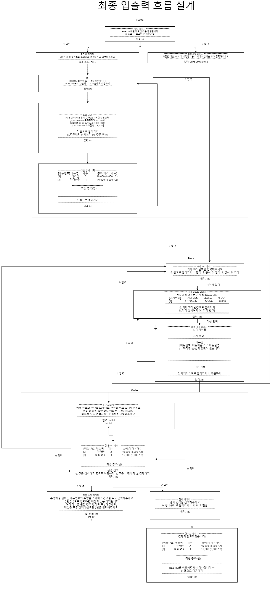

# BESTful
CLI 기반 배달의 민족 어플리케이션
- 언어: Java (Spring 프레임워크 미사용)
- 설계 패턴: MVC (Model-View-Controller) 패턴을 이용하여 구현
- 기간 2024.07.10 ~ 2024.07.15
<br />

### 구현 기능 리스트

- 회원가입/탈퇴
- 로그인/로그아웃
- 주문/장바구니/결제
- 주문내역 상세 확인
  <br />

### 입출력 흐름 설계

회원가입부터 주문 완료까지 전반적인 서비스의 입출력 흐름을 아래와 같이 설계함

<br />

### 패키지 구조 설계

MVC를 도메인 단위로 분리함

- M: 비즈니스로직, DB,기타 연산
- V: 콘솔 출력, 콘솔 입력
- C: view와 모델을 가지고 결과를 도출하는 로직이 있는 메소드들의 모임

```
📦src
 ┣ 📂exception
 ┣ 📂function
 ┃ ┣ 📜MainFunction.java
 ┃ ┣ 📜OrderFunction.java
 ┃ ┗ 📜UserFunction.java
 ┣ 📂main
 ┃ ┣ 📂view
 ┃ ┃ ┗ 📜MainView.java
 ┃ ┗ 📜MainController.java
 ┣ 📂order
 ┃ ┣ 📂model
 ┃ ┃ ┣ 📜Cart.java
 ┃ ┃ ┣ 📜CartService.java
 ┃ ┃ ┣ 📜Order.java
 ┃ ┃ ┣ 📜OrderDAO.java
 ┃ ┃ ┣ 📜OrderMenu.java
 ┃ ┃ ┗ 📜OrderService.java
 ┃ ┣ 📜OrderController.java
 ┃ ┗ 📜OrderView.java
 ┣ 📂store
 ┃ ┣ 📂model
 ┃ ┃ ┣ 📜DishInfo.java
 ┃ ┃ ┣ 📜Menu.java
 ┃ ┃ ┣ 📜MenuGM.java
 ┃ ┃ ┣ 📜Store.java
 ┃ ┃ ┣ 📜StoreDB.java
 ┃ ┃ ┣ 📜StoreOrderDTO.java
 ┃ ┃ ┗ 📜StoreService.java
 ┃ ┣ 📜StoreController.java
 ┃ ┗ 📜StoreView.java
 ┣ 📂user
 ┃ ┣ 📂model
 ┃ ┃ ┣ 📜User.java
 ┃ ┃ ┣ 📜UserDAO.java
 ┃ ┃ ┗ 📜UserService.java
 ┃ ┣ 📜UserController.java
 ┃ ┗ 📜UserView.java
 ┣ 📜Application.java
 ┗ 📜Main.java
```

<br />

### Git

### 브랜치

`main`<br/>
`feat/user-login`<br/>
✅ **main으로 바로 PR날리기**

### 커밋 컨벤션

💡 커밋 메세지: **명사형** (이모지 제외) <br/>
ex) 로그인 구현(O)<br/>
로그인 구현함, 로그인 구현했음(X)

| Icon & Description | Details                                           |
| ------------------ | ------------------------------------------------- |
| ✨ feat            | 새로운 기능 추가                                  |
| 🐛 fix             | 버그 수정                                         |
| ⚡️ update         | Fix와 달리 원래 정상적으로 동작했지만 보완의 개념 |
| ♻️ refactor        | 코드 리팩터링(기능 안바꿈)                        |
| 💄 design          | css 등 사용자 UI 디자인 변경                      |
| ⚒️ chore           | 빌드 업무 수정, 패키지 매니저 수정                |
| 📝 docs            | .md, text 수정                                    |
| 💡 comment         | 주석 추가 및 변경                                 |
| 🎨 style           | 코드스타일에 대한 변경                            |
| 🔥 remove          | 파일을 삭제하는 작업만 수행                       |
| 🚚 rename          | 파일 폴더명 수정 및 옮김                          |

<br />

### 팀 소개

<table>
  <tbody>
    <tr>
        <td align="center"><a href="https://github.com/ymkdev"><b>강경민</b></td>
        <td align="center"><a href="https://github.com/do-yoongyo2"><b>고유민</b></td>
        <td align="center"><a href="https://github.com/ijustwannabeme"><b>김경륜</b></td>
        <td align="center"><a href="https://github.com/wlsdk9803"><b>김윤경</b></td>
        <td align="center"><a href="https://github.com/Onek-2"><b>박경진</b></td>
        <td align="center"><a href="https://github.com/Onek-2"><b>정원우</b></td>
    </tr>
    <tr>
      <td align="center"><br /></td>
      <td align="center"><br /></td>
      <td align="center"><br /></td>
      <td align="center"><br /></td>
      <td align="center"><br /></td>
      <td align="center"><br /></td>
    </tr>
  </tbody>
</table>
